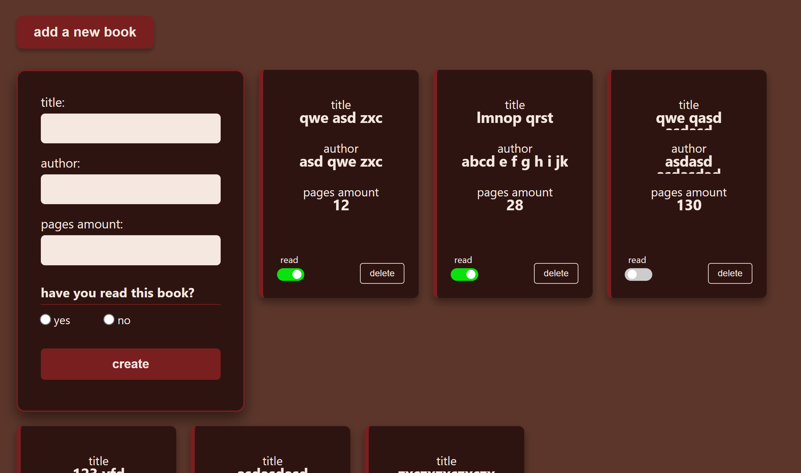

# Library

A lightweight web application for managing a personal book collection. This project demonstrates CRUD operations, dynamic DOM manipulation, and state management using vanilla JavaScript.

## Features

* **Book Management**: Add new books with details such as title, author, and page count.
* **Unique Identification**: Every book is assigned a unique ID using `crypto.randomUUID()` for precise state and DOM operations.
* **Duplicate Prevention**: Built-in logic checks if a book with the same title and author already exists in the library.
* **Read Status Toggle**: Interactive UI allowing users to switch the "read" status of individual books.
* **Responsive Design**: A flexible layout that adapts to different screen sizes using CSS Flexbox.

## Preview



## Tech Stack

* **HTML5**: Semantic markup for the library structure.
* **CSS3**: 
    * Custom properties (variables) for consistent branding.
    * Flexbox and Grid for layout management.
    * BEM naming conventions for styling.
* **JavaScript (ES6+)**:
    * Constructor functions and Prototypes for object-oriented book representation.
    * `FormData` API for efficient data retrieval from the input form.
    * Array methods (filter, some) for state management.

## Project Structure

```text
├── index.html   # Application structure and form layout
├── style.css    # Stylesheets with custom variables and responsive rules
├── script.js    # Core logic: Book objects, rendering, and event handling
└── lib.png      # Application screenshot
```
## Technical Implementation
Object-Oriented Approach
The application utilizes a Book constructor function. Shared methods, such as toggleRead, are attached to the Book.prototype to ensure memory efficiency.

## Dynamic Rendering
The bookRender function is responsible for creating DOM elements for each book. It programmatically attaches event listeners for deletion and status updates, ensuring that the UI remains in sync with the myLibrary data array.

## Installation
1. Clone the repository:

```bash
git clone [https://github.com/hnstz/Library-project.git](https://github.com/hnstz/Library-project.git)
```

2. Navigate to the directory:
```bash
cd Library-project
```

3. Open index.html in any modern web browser.
